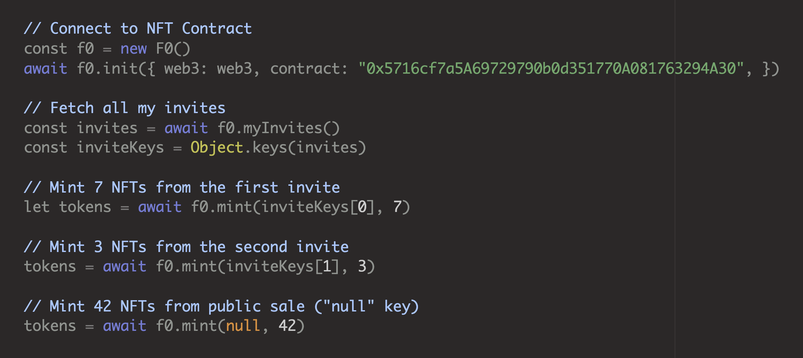
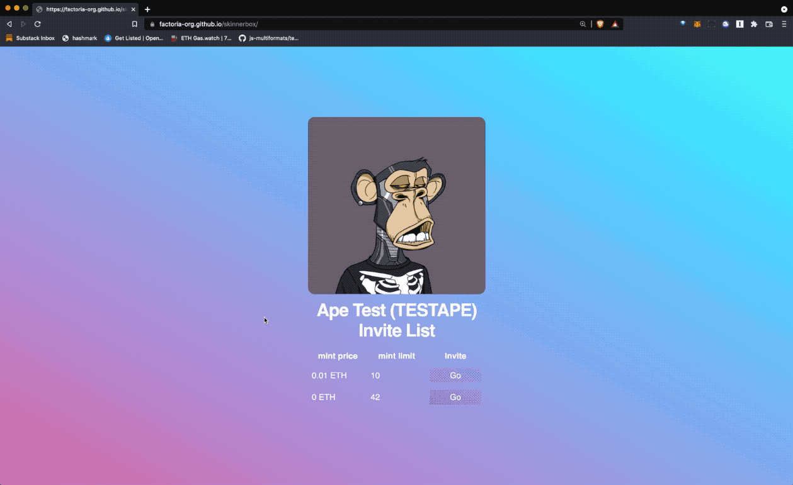

# f0.js

> Build your own NFT application with JavaScript

**f0.js is a cross-platform (browser and node.js) JavaScript library** that lets you easily build decentralized applications around your NFT collection, such as an NFT drop vending machine, NFT inspector, NFT bots, and more.

It abstracts away all the tedious things required to interact with an NFT collection such as:

- IPFS
- Web3
- Merkle Proof (Invite lists)
- Gas rate & coin exchange rate converstion

<br>

<a class='btn' href="https://github.com/factoria-org/f0js"><i class="fa-brands fa-github"></i> GitHub</a>
<a class='btn' href="https://discord.gg/BZtp5F6QQM"><i class="fa-brands fa-discord"></i> Discord</a>
<a class='btn' href="https://twitter.com/skogard"><i class="fa-brands fa-twitter"></i> Twitter</a>

---




## intro

`f0.js` is made up of the following APIs:

1. **[basic api](#basic-api):** the core convenience methods to interact with the F0 contract. These apis are usually enough for building a vending maching interface.
2. **[attributes](#attributes):** all the collection related attributes available once initialized.
3. **[web3 api](#web3-api):** cross-platform (both browser and node.js) interface to web3.js methods. If you want to build a full fledged web app around your NFT collection, you can use this.
4. **[utility functions](#utility-functions):** various useful utility functions (such as parsing URL, calculating exchange rate, calculating gas cost, etc.)

## prerequisites


> **WARNING**
>
> All demos in this documentation work on the Ethereum Rinkeby testnet.
>
> **Make sure you're connected to Rinkeby on your Metamask.**

If you want to try the demos with YOUR OWN COLLECTION, first go create your own NFT collection using Factoria: https://factoria.app

Once created, you can interact with the contract using f0.js. This documentation explains how to use f0.js.

- Follow on Twitter to stay updated: https://twitter.com/skogard
- Join Discord to ask questions: https://discord.gg/BZtp5F6QQM

## install

### browser

Include at the top of your HTML:

```
<script src="https://unpkg.com/f0js@0.0.14/dist/f0.js"></script>
```

and you can start using the global variable `F0` like this:

```javascript
const f0 = new F0();
...
```

### node.js

Install the `f0js` package:

```
npm install f0js
```

and you can start using the package like this:

```javascript
const F0 = require('f0js')
const f0 = new F0()
...
```

## demo

### vending machine app

Skinnerbox is a dead simple forkable NFT vending machine app: https://github.com/factoria-org/skinnerbox




---

# basic api

> **WARNING**
>
> All demos in this documentation work on the Ethereum Rinkeby testnet.
>
> **Make sure you're connected to Rinkeby on your Metamask.**

The F0 basic api is an abstraction around:

- [Web3.js](https://web3js.readthedocs.io/en/v1.2.11/index.html)
- [IPFS](https://github.com/factoria-org/ipfsh)
- [Merkle tree based invite list library](https://github.com/factoria-org/ipfsh)

optimized for interacting with [Factoria F0](https://github.com/factoria-org/f0) contract, which will make your life easier compared to if you implemented all of these yourself.

> For a low level protocol documentation that walks you through all the steps without using the f0.js library, see https://dev.factoria.app/f0

The F0 basic API will let you build an entire NFT minting website with just a couple of lines of JavaScript code.

> If you want to build a full fledged website incorporating ALL F0 contract methods, read the [web3 api](#web3-api) section.

## 1. constructor

must construct an instance first

```javascript
const f0 = new F0()
```

## 2. init

must initialize the instance

```javascript
const f0 = await f0.init({
  web3: web3,                   // (required) an instantiated web3 instance (both browser/node.js supported)
  contract: contract_address,   // (required) contract address
  currency: currency,           // your fiat currency: usd, jpy, eur, etc. default is "usd"
  key: private_key,             // only in node.js environment
  network: network              // "rinkeby" or "main" => explicitly set this attribute if you want to throw an error when the network is incorrect
})
```

### parameters

The `init()` method takes a single JSON argument, which can have the following attributes:

- `web3`: **(required)** an instantiated web3 instance. both browser/node.js supported
- `contract`: **(required)** the smart contract address
- `currency`: your fiat currency: **"usd"**, **"jpy"**, **"eur"**, etc. The default is "usd".
- `key`: your private key string (only in node.js environment).
- `network`: "rinkby" or "main". This is optional but if you want to throw an error if the user is signed into a wrong network, explicitly set this field and catch the error using `try/catch`.

### return value

returns the initialized F0 object.

## 3. get

```javascript
let token = await f0.get(tokenId)
```

Fetch a token at tokenId. Includes metadata.

### parameters

- `tokenId`: The tokenId

### return value

Example:

```json
token := {
  "tokenURI": "ipfs://bafkreic6dkpzpz637k3jt7g2vv3sey5dtqb2tlmwnfqn4txqhfi3mpw3di",
  "raw": {
    "image": "ipfs://bafybeihhl6qexxlf3x6jhhqfm2qdyrcctjrozx7nxfm5a7yo6ntgbajhea"
  },
  "converted": {
    "image": "https://ipfs.io/ipfs/bafybeihhl6qexxlf3x6jhhqfm2qdyrcctjrozx7nxfm5a7yo6ntgbajhea"
  }
}
```

- `token`: the token object, made up of the following attributes:
  - `tokenURI`: The tokenURI for the token
  - `raw`: the raw metadata fetched directly from the tokenURI
  - `converted`: converted metadata that replaces all IPFS links into HTTP links

### example: fetch one token

Get one token

<iframe width="100%" height="600" src="//jsfiddle.net/skogard/g2n9srve/8/embedded/html,result/" allowfullscreen="allowfullscreen" allowpaymentrequest frameborder="0"></iframe>

### example: fetch multiple tokens

Get multiple tokens

<iframe width="100%" height="700" src="//jsfiddle.net/skogard/epw35jnc/10/embedded/html,result/" allowfullscreen="allowfullscreen" allowpaymentrequest frameborder="0"></iframe>


## 4. myInvites

get all invites for this collection for the currently signed-in user.

```javascript
let invites = await f0.myInvites()
```

### parameters

none

### return value

returns an invite object. An invite object is made up of the following attributes:

```json
{
  <inviteKey1>: {
    key: <inviteKey1>,
    cid: <the IPFS CID at which the inivted address list for this key is stored>,
    condition: {
      raw: {
        price: <mint condition (how much per token) in wei>,
        start: <mint start time>,
        limit: <mint limit per address>
      },
      converted: {
        eth: <mint condition converted in ETH>,
        <currency>: <mint condition converted in the default currency>,
        start: <JavaScript Date object that represents the mint start time>,
        limit: <mint limit per address>
      }
    },
    list: <an array of addresses on this list, directly fetched from IPFS>,
    proof: <merkle proof for the current user for this invite key>,
    invited: <true if the current user is invited, false if not>
  },
  <inviteKey2>: ...,
  <inviteKey3>: ...
  ...
}
```

Here's an actual example:

```json
{
  "0x74eff7f79000da537011a1b24a2531e9bce29ac07061e4ff141658ae4129231a": {
    "key": "0x74eff7f79000da537011a1b24a2531e9bce29ac07061e4ff141658ae4129231a",
    "cid": "bafkreihi3zlnto3l47l3tg5dcsrjgbqdjp5hplhjisiqzuq5gbvkbudm3a",
    "condition": {
      "raw": {
        "price": 100000000000000000,
        "start": 1639495740,
        "limit": 42
      },
      "converted": {
        "eth": 0.1,
        "start": "2021-12-14T15:29:00.000Z",
        "limit": 42,
        "usd": 382.836
      }
    },
    "list": [
      "0x73316d4224263496201c3420b36Cdda9c0249574",
      "0xB7e390864a90b7b923C9f9310C6F98aafE43F707",
      "0xa84e7cc73ae095bed288a799aa6f870f52fce6b4",
      "0xFb7b2717F7a2a30B42e21CEf03Dd0fC76Ef761E9"
    ],
    "proof": [
      "0xc1eb369bacd52a3044c24f7995207b48131d098e8a38a57b1ebfcf488cd25041",
      "0x9466364966e1d172ba293b9b5c173ba9a9638b0c3f3e559c9ec1e4d519f9742e"
    ],
    "invited": true
  },
  "0x0000000000000000000000000000000000000000000000000000000000000000": {
    "key": "0x0000000000000000000000000000000000000000000000000000000000000000",
    "cid": "bafkreiaaaaaaaaaaaaaaaaaaaaaaaaaaaaaaaaaaaaaaaaaaaaaaaaaaaa",
    "condition": {
      "raw": {
        "price": 420000000000000000,
        "start": 1639495860,
        "limit": 69
      },
      "converted": {
        "eth": 0.42,
        "start": "2021-12-14T15:31:00.000Z",
        "limit": 69,
        "usd": 1607.9112
      }
    },
    "list": [],
    "proof": [],
    "invited": true
  }
}
```

You can use the invite object to display relevant information to the users, such as mint price in the default currency, invited addresses, and so on.

### example

<iframe width="100%" height="900" src="//jsfiddle.net/skogard/qmzfxsoc/20/embedded/html,result/" allowfullscreen="allowfullscreen" allowpaymentrequest frameborder="0"></iframe>


## 5. invites

similar to [myInvites](#3-myinvites), but returns ALL invites for the collection, not just the ones the current user is invited to.

```javascript
let invites = await f0.invites()
```

### parameters

none

### return value

See [myInvites](#3-myinvites) section. 

### example

<iframe width="100%" height="600" src="//jsfiddle.net/skogard/cqmsazyj/12/embedded/html,result/" allowfullscreen="allowfullscreen" allowpaymentrequest frameborder="0"></iframe>

## 6. invite

get an invite by key

```javascript
let invite = f0.invite(key)
```

### parameters

- `key`: The invite key. Returns the public invite if left empty or `null` is passed. (example: `f0.invite()` or `f0.invite(null)` returns the public invite object)

### return value

The invite object for the invite key


## 7. mint

mint tokens using an invite key

```javascript
let tokens = await f0.mint(inviteKey, mintCount, options)
```

### parameters

- `inviteKey`: the invite key to use for minting. if `null`, it will mint from the public launch invite.
- `mintCount`: how many tokens to mint.
- `options`: (optional) can have 2 of the attributes supported by web3.js (see https://web3js.readthedocs.io/en/v1.2.11/web3-eth-contract.html#id33). If unspecified, uses the default values suggested by the user's wallet:
  - `gas`: gas limit
  - `gasPrice`: gas price

### return value

- `tokens`: An array of tokens successfully minted. Each token has the following attributes:
  - `tokenId`: The tokenId
  - `links`: some relevant links for the token, such as marketplace URLs
    - `rarible`: rarible link for the token
    - `opensea`: opensea link for the token

### example

<iframe width="100%" height="600" src="//jsfiddle.net/skogard/pzkd182q/9/embedded/html,result/" allowfullscreen="allowfullscreen" allowpaymentrequest frameborder="0"></iframe>

### advanced (custom gas price)

For example, you may want to let people mint with the lowest (and slowest) gas fee option. You can:

1. use the [#_2-cost](cost()) method to get the different gas rate options, and find out the lowest rate.
2. call the `mint()` function with the `{ gasPrice: <lowest_gasPrice_option> }` as the `options` parameter.

Another example, if you want to suggest multiple gas price options to the users, you may:

1. use the [#_2-cost](cost()) method to get the different gas rate options
2. when the user selects one of the options, pass the `{ gasPrice: <the selected rate> }` as the `options` parameter.

By default, if you don't pass the `options` parameter, it will automatically choose the safest option provided by the user's wallet. This is recommended in most cases but if you want to provide choice to your minters, you can use the `options` parameter.


## 8. mintCost

get the minting cost estimate.

```javascript
let estimate = await f0.mintCost(inviteKey, mintCount, options)
```


### parameters

- `inviteKey`: the invite key to use for minting. if `null`, it will mint from the public launch invite.
- `mintCount`: how many tokens to mint.
- `options`: (optional) can have 2 of the attributes supported by web3.js (see https://web3js.readthedocs.io/en/v1.2.11/web3-eth-contract.html#id33). If unspecified, uses the default values suggested by the user's wallet:
  - `gas`: gas limit
  - `gasPrice`: gas price

### return value

- `estimate`: the estimate cost for minting
  - `eth`: The cost in eth
  - `<currency>`: The cost converted to whichever currency you initialized `f0` with (through `f0.init()`)
  - `gas`: The gas estimate

Example:

```json
estimate := {
  "eth": {
    "fastest": 0.00639288,
    "fast": 0.00631092,
    "average": 0.00565524,
    "safeLow": 0.00540936
  },
  "usd": {
    "fastest": 25.6202976744,
    "fast": 25.2918323196,
    "average": 22.6641094812,
    "safeLow": 21.6787134168
  },
  "gas": 81960
}
```

### example

<iframe width="100%" height="600" src="//jsfiddle.net/skogard/psLfdro9/3/embedded/html,result/" allowfullscreen="allowfullscreen" allowpaymentrequest frameborder="0"></iframe>


## 8. logs

Get logs based on an event name.

```javascript
let logs = await f0.logs(eventName, options)
```

### parameters

- `eventName`: The name of the events to read from. The F0 contract supports the following events:
  - `"Invited"`: An invite created on chain
  - `"NSUpdated"`: Name or symbol has changed
  - `"Configured"`: The config object (placeholder, base, supply, permanent) has been updated
  - `"WithdrawerUpdated"`: The withdrawer has been updated
- `options`: **(optional)** The "options" object passed to [web3.js getPastEvents](https://web3js.readthedocs.io/en/v1.2.11/web3-eth-contract.html#getpastevents). 

### return value

the evm log

### example

<iframe width="100%" height="800" src="//jsfiddle.net/skogard/76gyahzw/12/embedded/html,result/" allowfullscreen="allowfullscreen" allowpaymentrequest frameborder="0"></iframe>

## 9. nextId

Get the next available tokenId for minting

```javascript
let nextId = await f0.nextId()
```

### parameters

none

### return value

The next available tokenId


## 10. name

Get the "name" attribute of the collection

```javascript
let name = await f0.name()
```

### parameters

none

### return value

The collection name


## 11. symbol

Get the "symbol" attribute of the collection

```javascript
let symbol = await f0.symbol()
```

### parameters

none

### return value

The collection symbol


## 12. config

Get the collection configuration ("placeholder", "base", "supply", "permanent")

```javascript
let config = await f0.config()
```

### parameters

none

### return value

Returns an object that includes two attributes:

- `raw`: the raw config object
- `converted`: a converted version of the raw config object that replaces "ipfs://" with "https://ipfs.io/ipfs/"

## 13. placeholder

Get the placeholder metadata JSON

```javascript
let placeholder = await f0.placeholder()
```

### parameters

none

### return value

Returns the metadata JSON for the NFT collection placeholder

---

# attributes

> **WARNING**
>
> All demos in this documentation work on the Ethereum Rinkeby testnet.
>
> **Make sure you're connected to Rinkeby on your Metamask.**

once you call `f0.init()`, the f0 instance will be initialized with various contract information:

## 1. address

The contract address

```javascript
const contract_address = f0.address
```

## 2. currency

The default currency set by the `init()` function. (default: "usd")

```javascript
const default_currency = f0.currency
```

## 3. account

The currently signed in account

```javascript
const current_user = f0.account
```

## 4. api

The [web3 API interface](#web3-api)

```javascript
const api = f0.api
let name = await api.name().call()
let symbol = await api.symbol().call()
```


---

# web3 api

> **WARNING**
>
> All demos in this documentation work on the Ethereum Rinkeby testnet.
>
> **Make sure you're connected to Rinkeby on your Metamask.**

You may want to use web3.js to interact with various contract methods directly.

The initialized `f0` object exposes an interface named `api` that lets you call web3 methods.

> NOTE
>
> To learn what contract methods are available, take a look at https://dev.factoria.app/f0/#/?id=methods

## 1. initializing

`f0.js` lets you inject any web3 instance into it to initialize.

This means you can use f0.js **both in the browser and node.js**.

1. In many cases you will use f0.js in the browser through browser wallets like Metamask.
2. However you can also build some cool automated features in node.js

### Browser

In the browser, you can simply inject the default web3 instance initialized from `window.ethereum` object:

```javascript
<html>
<head>
<script src="https://cdnjs.cloudflare.com/ajax/libs/web3/1.7.0-rc.0/web3.min.js"></script>
<script src="https://unpkg.com/f0js/dist/f0.js"></script>
<script>
const f0 = new F0();
document.addEventListener("DOMContentLoaded", async () => {
  await f0.init({
    web3: new Web3(window.ethereum),
    contract: contract_address
  })
  let tokens = await f0.mint(null, 3)   // mint 3 tokens!
})
</script>
</head>
</html>
```

### Node.js

In node.js, you will need to 2 additional things:

1. connect to an RPC provider
2. instantiate wallet with a private key

Here's an example where you connect an instance with [Alchemy web3](https://docs.alchemy.com/alchemy/documentation/alchemy-web3):

```javascript
const { createAlchemyWeb3 } = require("@alch/alchemy-web3");
const F0 = require("f0js")
const f0 = new F0();
await f0.init({
  web3: createAlchemyWeb3(process.env.RINKEBY_URL),
  contract: contract_address,
  key: PRIVATE_KEY
})
```

## 2. calling methods

Once initialized, the `f0` object lets you call web3 methods using its `api` interface:

1. `f0.api.<method_name>.call()`
2. `f0.api.<method_name>.send()`

which are equivalent to the following web3.js native contract methods:

1. `contract.methods.<method_name>.call()`
2. `contract.methods.<method_name>.send()`

There is also one more method:

- `f0.api.<method_name>.estimate()`: equivalent to calling `contract.methods.<method_name>.estimateGas()` and then applying current exchange rate and gas rate.

The benefit of using `f0.api` interface is that you can use it cross-platform (both in browser and node.js).

### send

Example:

```javascript
let tokens = await f0.api.mint({
  key: "0x0000000000000000000000000000000000000000000000000000000000000000", proof: []
}, 1).send({
  value: "10000000000000000"
})
```

### call

Example:

```javascript
let nextId = await f0.api.nextId().call()
let owner = await f0.api.ownerOf(1).call()
```


<iframe width="100%" height="500" src="//jsfiddle.net/skogard/3y59xcu7/8/embedded/html,result/" allowfullscreen="allowfullscreen" allowpaymentrequest frameborder="0"></iframe>

### estimate

You can estimate gas cost for all Web3 `send()` methods.

Here's an example for estimating minting cost:

```javascript
let mintEstimate = await f0.api.mint({
  key: "0x0000000000000000000000000000000000000000000000000000000000000000", proof: []
}, 1).estimate({
  from: f0.account,
  value: "420000000000000000"
})
//
//  mintEstimate := {
//    "eth": {
//      "fastest": 0.0099918,
//      "fast": 0.0083265,
//      "average": 0.007244055,
//      "safeLow": 0.006577935
//    },
//    "usd": {
//      "fastest": 40.033445634,
//      "fast": 33.361204695000005,
//      "average": 29.02424808465,
//      "safeLow": 26.35535170905
//    },
//    "gas": 83265
//  }
//
```

Here's an example for estimating setConfig cost:

```javascript
let configEstimate = await f0.api.setConfig({
  placeholder: "placeholder",
  base: "baseURI",
  supply: 1000,
  permanent: false
}).estimate({
  from: f0.account,
  value: "420000000000000000"
})
//
//  configEstimate := {
//    "eth": {
//      "fastest": 0.00917952,
//      "fast": 0.00803208,
//      "average": 0.0069666,
//      "safeLow": 0.00631092
//    },
//    "usd": {
//      "fastest": 36.791975136000005,
//      "fast": 32.192978244,
//      "average": 27.92248113,
//      "safeLow": 25.294482906000002
//    },
//    "gas": 81960
//  }
//
```

---

# utility functions

> **WARNING**
>
> All demos in this documentation work on the Ethereum Rinkeby testnet.
>
> **Make sure you're connected to Rinkeby on your Metamask.**

## 1. convert

Take any JavaScript object and turn every occurrence of `ipfs://...` into `https://ipfs.io/ipfs/...`

```javascript
let converted = f0.convert(original)
```

### parameters

- `original`: the original javascript object to convert

### return value

the same javascript object, but with all occurrences of `ipfs://<cid>` replaced with `https://ipfs.io/ipfs/<cid>`

### example

<iframe width="100%" height="650" src="//jsfiddle.net/skogard/736hgumn/7/embedded/html,result/" allowfullscreen="allowfullscreen" allowpaymentrequest frameborder="0"></iframe>


## 2. cost

Queries coingecko and ethGasStation APIs to return the current exchange rate and the current network fee rate:

```javascript
let cost = await f0.cost()
```

### parameters

none

### return value

- `cost`: the cost object constructed by merging coingecko and ethGasStation API results:
  - `gas`: The gwei/gas ratio
  - `price`: the ethereum exchange rate for the default currency (you can set the default currency in [init()](#_2-init)

```json
{
  "gas": {
    "fast": 830,
    "fastest": 890,
    "safeLow": 590,
    "average": 700,
    "block_time": 15.226415094339623,
    "blockNum": 13804250,
    "speed": 0.5804163185738596,
    "safeLowWait": 21.6,
    "avgWait": 3.6,
    "fastWait": 0.5,
    "fastestWait": 0.5
  },
  "price": 3787.53
}
```

### example

<iframe width="100%" height="500" src="//jsfiddle.net/skogard/p2ndus4t/4/embedded/html,result/" allowfullscreen="allowfullscreen" allowpaymentrequest frameborder="0"></iframe>


## 3. estimate

pass gas amount and get the estimate cost calculated from [cost()](#_2-cost).

```javascript
let estimate = await f0.estimate(gas)
```

### parameters

- `gas`: The gas amount (example: 242946)

### return value

- `estimate`: the estimate cost object
  - `eth`: the estimate cost in ETH
  - `fiat`: the estimate cost in the default currency (set in [init()](#_2-init)

example:

```json
{
  "eth": {
    "fastest": 0.029396466,
    "fast": 0.025023438,
    "average": 0.017978004,
    "safeLow": 0.016034436
  },
  "usd": {
    "fastest": 110.6527074939,
    "fast": 94.1919741477,
    "average": 67.6719037566,
    "safeLow": 60.3560222694
  }
}
```

### example

<iframe width="100%" height="600" src="//jsfiddle.net/skogard/v0t2qpLd/9/embedded/html,result/" allowfullscreen="allowfullscreen" allowpaymentrequest frameborder="0"></iframe>


## 4. parseURL

```javascript
let parsed = f0.parseURL(url)
```

url parser helper function for parsing URLs with hashes into key/value pairs.


### parameters

- `url`: any web url with a hash value

This function parses any URL that takes the following form:

```
<protocol>://<host>/<path>#<key1>=<val1>&<key2>=<val2>...
```

### return value

The function parses the key value paris from the URL hash and returns a JavaScript object.

Example:

```
{
  <key1>: <val1>,
  <key2>: <val1>,
  ...
}
```

### example

<iframe width="100%" height="500" src="//jsfiddle.net/skogard/4p67h25c/7/embedded/html,result/" allowfullscreen="allowfullscreen" allowpaymentrequest frameborder="0"></iframe>

## 5. calc

Take an invite object (fetched through `await f0.invite(inviteKey)`) or an invites object (fetched through `await f0.invites()` or `await f0.myInvites()`), and returns a new version with an additional `currency` attribute attached (calculated based on coingecko api)

```javascript
let invite = await f0.invite("0x0000000000000000000000000000000000000000000000000000000000000000")
let calculated = await f0.calc(invite)
```

or

```javascript
let invites = await f0.invites()
let calculated = await f0.calc(invites)
```

### parameters

- `invite`: A single `invite` object that contains a "price" attribute, or an `invites` object that contains ALL invite objects in a contract

For example:

```json
let calculated = await f0.calc({
  "0x0000000000000000000000000000000000000000000000000000000000000000": {
    "key": "0x0000000000000000000000000000000000000000000000000000000000000000",
    "cid": "bafkreiaaaaaaaaaaaaaaaaaaaaaaaaaaaaaaaaaaaaaaaaaaaaaaaaaaaa",
    "condition": {
      "raw": {
        "price": 10000000000000000,
        "start": 1639451760,
        "limit": 1000
      },
      "converted": {
        "eth": 0.01,
        "start": "2021-12-14T03:16:00.000Z",
        "limit": 1000
      }
    },
    "list": [],
    "proof": [],
    "invited": true
  }
})
```

### return value

attaches a `<currency>` attribute (default is 'usd') under the `"condition.converted"` path and returns the result.

### example

<iframe width="100%" height="500" src="//jsfiddle.net/skogard/j95wpavL/11/embedded/html,result/" allowfullscreen="allowfullscreen" allowpaymentrequest frameborder="0"></iframe>

---

# howto

## 1. how to handle incorrect network

A user may be signed into rinkeby network when the app is for mainnet, or the user may be signed into mainnet when the app is for rinkeby.

To alert the user to sign into a different network in these cases, you can explicitly set the "network" and handle the thrown error.

For example if you want an app to load from rinkeby and alert people to sign into rinkeby instead of mainnet, you can set the network to "rinkeby" and handle the exception:

```javascript
try {
  await f0.init({
    web3: new Web3(window.ethereum),
    contract: contract_address,
    network: "rinkeby"
  })
} catch (e) {
  // display an alert
  alert(e.message)
}
```

## 2. how to display errors

Whenever you try to interact with the blockchain using [send()](#send) and there's an error, or if you try to use the [mint()](#_7-mint) function and there's an error, it will fail silently.

To display the error to the users, you can simply put the methods inside a `try/catch` clause and handle the error:

```javascript
try {
  let tx = await f0.mint(null, 10)
} catch (e) {
  alert(e.message)
}
```

or

```javascript
try {
  let tokens = await f0.api.mint({
    key: "0x0000000000000000000000000000000000000000000000000000000000000000", proof: []
  }, 1).send({
    value: "10000000000000000"
  })
} catch (e) {
  alert(e.message)
}
```

---
